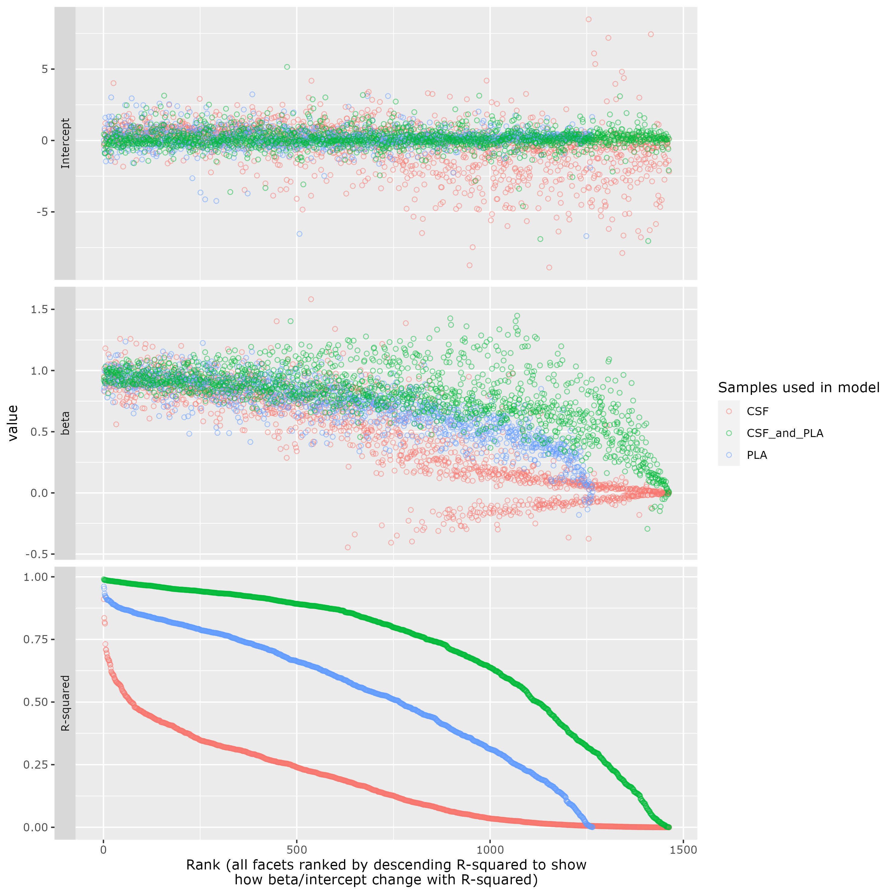
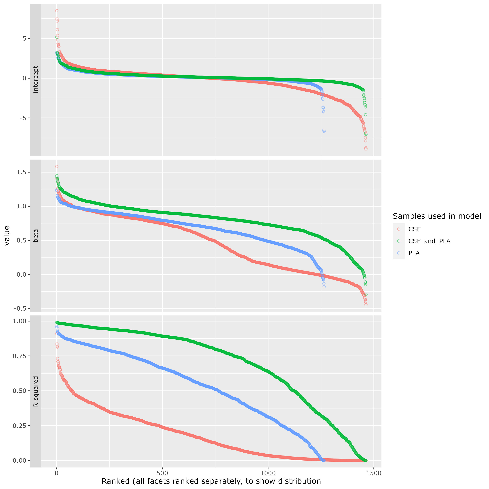
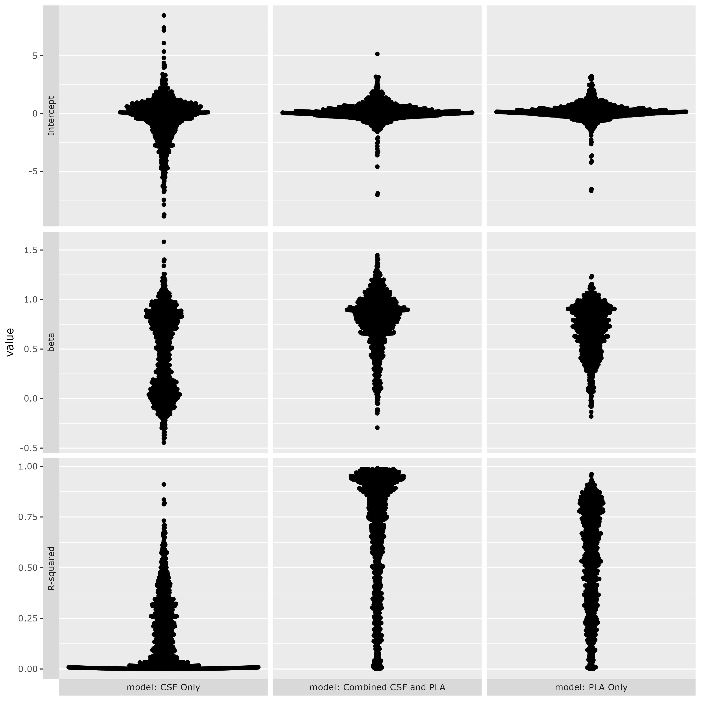

# README

## Setup and formatting data
Link data directory and ignore from git tracking
```bash
ln -s /data/CARD/projects/proteomicsXprogression_PD/data-allreleases rawdata
echo 'rawdata' >> .gitignore
```

Generate summary table [`mds_scores.tsv`](reports/mds_scores.tsv) for MDS scores from [`combine_mds_scores.R`](src/combine_mds_scores.R)
```bash
module load R/3.6.3
Rscript src/combine_mds_scores.R
```

Call [`format_protein_data.R`](src/format_protein_data.R) to read and reformat various protein quantification matrices, concatenating into a single long-form file [`protein_quantification.tsv`](reports/protein_quantification.tsv)
```bash
module load R/3.6.3
Rscript src/combine_mds_scores.R
```

## First analyses

<details><summary>  PLA vs CSF correlations </summary>


</details>

<details><summary>Correlations between PPMI-1 and PPMI-2</summary>

39 individuals overlapping between the two data sets. Code for figures in [`format_protein_data.R`](src/format_protein_data.R)


</details>

<details><summary>M4 Modules</summary>

[`M4.tsv`](reports/M4.tsv) derived from [Supplementary Table `2B_ModuleAssignments`](https://doi.org/10.1038/s41591-020-0815-6)[^1] where column `kMEtableSortVector %like% 'M4'`. Code for figures in [`format_protein_data.R`](src/format_protein_data.R)


</details>

## Combining data sets

Goal: to combine data sets PPMI D02 and D01. Built linear models separately for every protein, looking
at individuals that overlap between the two data sets. PPMI1 is predicted from PPMI2 values, i.e.
`PPMI1_NPX ~ PPMI2_NPX` for data at `month==0`, either looking only at CSF, only at PLA, or all data.

The script for generating the models and figures: [`PPMI_merge_model.R`](src/PPMI_merge_model.R)

The coefficients and other stats (e.g. r-squared) of all models are combined into a single summary table
[`PPMI2-1-model.tsv`](reports/PPMI2-1-model.tsv).


<details><summary>Ranked by R-squared</summary>

The data in these figures represents estimated intercepts, slopes (beta coefficeints) and r-squared
values on a per-protein basis. For each method of generating the model (color), the proteins are sorted in descending R-squared rank.




</details>

<details><summary>Ranked Independently</summary>

Same as previous, except points are sorted in descending rank independently for intercept, beta, and
R-squared (to visualize distributions).




</details>


<details><summary>Beeswarms</summary>

Same data but plotted as beeswarms.




</details>


# Citations
[^1]: Johnson, E.C.B., Dammer, E.B., Duong, D.M. et al. Large-scale proteomic analysis of Alzheimer’s disease brain and cerebrospinal fluid reveals early changes in energy metabolism associated with microglia and astrocyte activation. Nat Med 26, 769–780 (2020). https://doi.org/10.1038/s41591-020-0815-6
